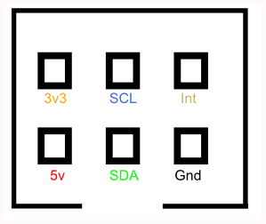
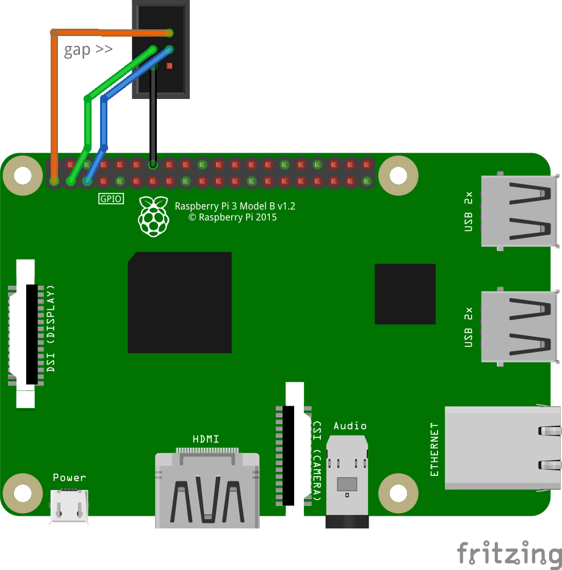

# Quick2Wire board support

Quick2Wire Limited was a UK-based startup that made add-on boards for the Raspberry Pi.

The company ceased trading some years ago and the developers have moved on to other projects.

The Pi has moved on as well. All the old Quick2Wire software and documentation are so out-of-date that
they are unusable.

This repository will contain replacement code and (eventually) documentation.

It already allows you to use the Quick2Wire MCP23017 Port Expander and PCF8591 Analogue boards with a Raspberry Pi
running buster with Adafruit Blinka.

The code is currently pre-alpha, and PCF8591 functionality is very limited, but it may be enough to get you started.

## Connecting the boards to the Pi

The Quick2wire boards include an interface board to which the other boards are connected.
The board was designed before the Pi adopted a 40-pin GPIO header.

If you have an interface board and want to use it to a modern Pi you can connect it to a 40-pin Pi using a *downverter*
 - a special cable that has a 40-pin connector at one end and a 26-pin connector on the other.

Raspberry Pi Downverters are available from
[SK Pang](http://skpang.co.uk/catalog/downgrade-gpio-ribbon-cable-for-raspberry-pi-model-b-40p-to-26p-p-1358.html)
or you can make your own.

You can also connect the boards directly to the Pi. 
Here is the I2c pinout

The fritzing diagram blow shows how to use jumper wires to connect a Pi directly to an IDC connector on the analog or port expander boards.

To run the samples in the quick2wire package, you'll need to install Adafruit Blinka library and their MCP230xx
library on your Pi 

To do that, run `sudo pip3 install adafruit-circuitpython-mcp230xx`

Then you can run the examples using python3.

I'm also working on a collection of boards and software thet make it easy to connect a range of peripherals to various single board computers. The [hardware](https://github.com/romilly/babelboard-hardware) and [software](https://github.com/romilly/babelboard-software) are on GitHub.
