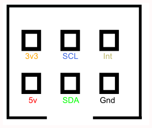

# I2C Pinout for the Quick2Wire boards

Here is the pionout for the IDC connector used on the Quuick2Wire I2C-based boards:

The Int line is used to signal an interrupt from those boards that can generate one, including the MCP23017 Port Expander Board.

The 3v3 line was powered by the Interface Boards’ voltage regulator
which provided a much higher current than the 3.3 volt supply on the original Pi.

For most applications, powering the board from the Pi's supply should not be a problem.

The boards should be used in 3.3 Volt mode (jumper selectable).

The image below shows a Pi 3B directly connected to a PCF8591 Analogue Board.

